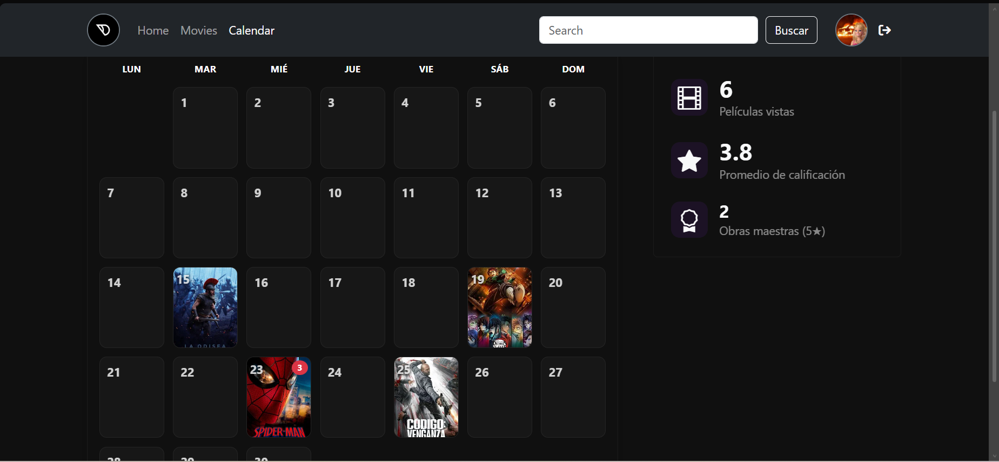

# CrownNest 🎬

CrownNest is a full-stack web application designed for user-driven movie reviews. It allows users to explore, share, and manage movie reviews seamlessly, featuring a robust backend architecture and optimized database management.

`

## 🚀 Technologies Used
* **Frontend:** JavaScript, HTML5, CSS3
* **Backend:** Node.js, Express.js (REST API)
* **Database:** MongoDB
* **Tools:** Git, GitHub, Postman (for API testing)

## ✨ Key Features
* **Full-Stack Architecture:** Built from scratch to handle end-to-end user interactions and data flow.
* **RESTful Endpoints:** Secure API routes developed in Node.js to handle asynchronous requests and real-time user inputs.
* **Optimized Database Schema:** Designed scalable collections in MongoDB to ensure high-performance data storage, retrieval, and fast synchronization.
* **User Reviews & Interactions:** Allows users to post, read, and manage cinematic reviews efficiently.

## 📋 Prerequisites

Before you begin, ensure you have the following installed:
* [Node.js](https://nodejs.org/) (v14 or higher)
* [MongoDB](https://www.mongodb.com/) (Local installation or MongoDB Atlas cluster)

## 🛠️ Getting Started & Installation

To run this project locally, follow these steps:

1. **Clone the repository:**
   ```bash
   git clone https://github.com/tu-usuario/crownnest.git
   ```
2. **Movr to BACKEND:**
   ```bash
   cd BACKEND
   ```
3. **Install dependencies:**
   ```bash
   npm install
   ```
4. **Environment Variables:**
   ```bash
   PORT=3000
   MONGODB_URI=your_mongodb_connection_string
   ```
5. **Run the application:**
   ```bash
   npm start
   ```

## Contact
Yeshua Miranda - [LinkedIn](www.linkedin.com/in/yeshua-miranda-morales-a00941396) - yeshuamirandamor@gmail.com
